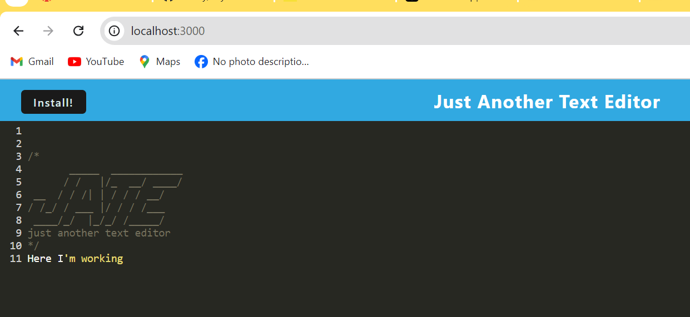

# Lily-PWA-Text-Editor

## Description
A progressive Web APP(PWA) is a web application that offers a user experience smiliar to a 
native app.

## Tables of Contents
Overview
The Challenge
Usage
Installation Process
Built With
What I Learned
License

## Overview
The Challenge:
The challenge was about creating a PWA utilizing specific back-end technologies like webpack and manifest.
 
 ## User Story 

 AS A developer
I WANT to create notes or code snippets with or without an internet connection
SO THAT I can reliably retrieve them for later use

## Acceptance Criteria

GIVEN a text editor web application
WHEN I open my application in my editor
THEN I should see a client server folder structure
WHEN I run `npm run start` from the root directory
THEN I find that my application should start up the backend and serve the client
WHEN I run the text editor application from my terminal
THEN I find that my JavaScript files have been bundled using webpack
WHEN I run my webpack plugins
THEN I find that I have a generated HTML file, service worker, and a manifest file
WHEN I use next-gen JavaScript in my application
THEN I find that the text editor still functions in the browser without errors
WHEN I open the text editor
THEN I find that IndexedDB has immediately created a database storage
WHEN I enter content and subsequently click off of the DOM window
THEN I find that the content in the text editor has been saved with IndexedDB
WHEN I reopen the text editor after closing it
THEN I find that the content in the text editor has been retrieved from our IndexedDB
WHEN I click on the Install button
THEN I download my web application as an icon on my desktop
WHEN I load my web application
THEN I should have a registered service worker using workbox
WHEN I register a service worker
THEN I should have my static assets pre cached upon loading along with subsequent pages and static assets
WHEN I deploy to Render
THEN I should have proper build scripts for a webpack application

## Usage

To design an application by using web technologies that can be installed and run on all deveices, from one codebase.

## Installation Process

1. clone the repository from GitHub using the command git clone
2. Open the cloned repository in VSC or any source code editor
3. Open an integrated terminal of the document (Lily-PWA-Text-Editor)
4. Run  command npm i &  command npm run build 
5. Run the command npm start 

## Built With 
Json
Node.js:16.18.1
Visual Studio Code
JavaScript
Webpack : 5.95.0
Manifest
Babel : 7.15.0

## What I learned 

To build a PWA application that provide native-like experience.

## Screenshot 

## License 
MIT